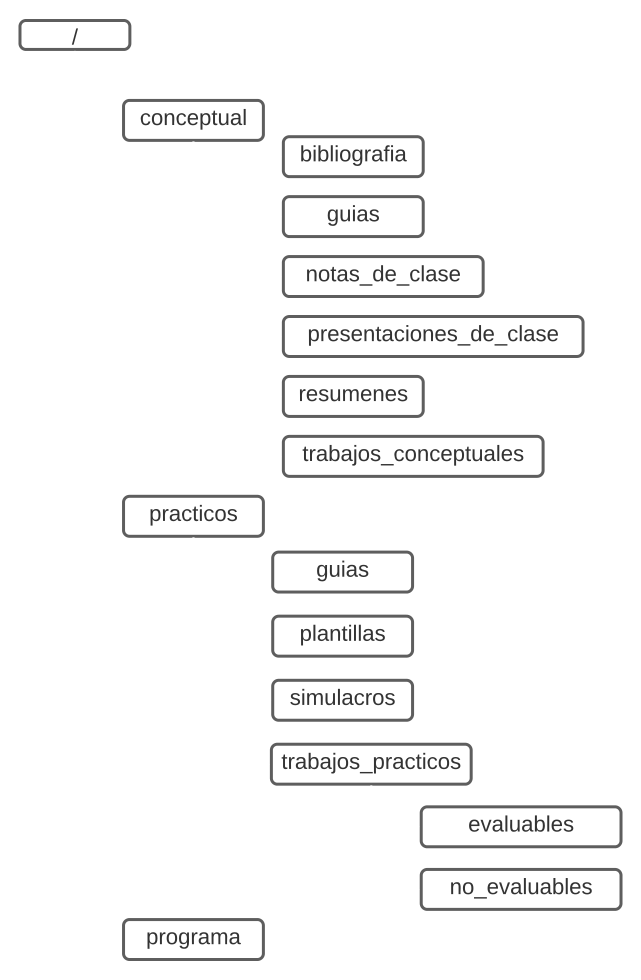

# Universidad Tecnológica Nacional - Facultad Regional de Córdoba - Ingeniería De Software 2023

## Información del curso

### Curso 4K4 - Turno Noche

### Docentes:

- **Adjunto:** Ing. Laura Covaro
- **Auxiliares de Trabajos Prácticos:** Ing Gerardo Boiero & Ing. Mickaela Crespo

### Información del grupo

**Grupo número:** 13

| Apellido y Nombre | Legajo |
| --- | --- |
| Bendezu Gonzalez, Jonathan Leonel | 82425 |
| Martini, Valentin Eduardo | 83012 |
| Monutti, Gabriel | 88982 |
| Fada, Santiago Joaquin | 81950 |
| Perez Contreras, Ignacio | 81949 |

---

# Estructura del repositorio

---

# Listado de **Ítems de configuración**

| Nombre del Ítems de configuración | Regala de nombrado | Ubicación Física (Ruta Relativa) |
| --- | --- | --- |
| Programa de la materia | ISW_PROGRAMA_2023.pdf | /programa/ |
| Cronograma | ISW_CRONOGRAMA_4K4_2023.url | /programa/ |
| Guías Practicas | ISW_GP_\<GX>_2023.pdf | /practicos/guia/ |
| Trabajos Prácticos Evaluables Enunciados | TPE_\<TX>_\<DESCRIPCIÓN>_ENUNCIADO_2023.pdf | /practicos/trabajos_practicos/evaluables/ |
| Trabajos Prácticos Evaluables Resolución | TPE_\<TX>_\<DESCRIPCIÓN>_RES_G13_2023.\<ext> | /practicos/trabajos_practicos/evaluables/ |
| Trabajos Practico No Evaluables Enunciados | TPN_\<TX>_\<DESCRIPCIÓN>_ENUNCIADO_2023.pdf | /practicos/trabajos_practicos/no_evaluables/ |
| Trabajos Prácticos No Evaluables Resolución | TPN_\<TX>_\<DESCRIPCIÓN>_RES_G13_2023.\<ext> | /practicos/trabajos_practicos/no_evaluables/ |
| Simulacros Enunciados | SIM_\<PX>_2023.pdf | /practicos/trabajos_practicos/simulacros/ |
| Simulacros Propuesta Alumno | SIM_\<PX>_\<LEGAJO>_2023.pdf | /practicos/trabajos_practicos/simulacros/ |
| Simulacros Resolución Catedra | SIM_\<PX>_CATEDRA_2023.pdf | /practicos/trabajos_practicos/simulacros/ |
| Plantillas | PLA_\<DESCRIPCIÓN>_2023.\<ext> | /practicos/plantillas/ |
| Presentaciones de clase | PC_\<PCX>_\<DESCRIPCIÓN>_2023.pdf | /conceptual/presentaciones_de_clase/ |
| Bibliografía | BIBLIO_\<TEMA>_2023.pdf | /conceptual/bibliografia/ |
| Guías Conceptuales | ISW_GT_\<GX>_2023.pdf | /conceptual/guias/ |
| Trabajos Conceptuales Enunciados | TC_\<TX>_\<DESCRIPCIÓN>_ENUNCIADO_2023.pdf | /conceptual/trabajos_conceptuales/ |
| Trabajos Conceptuales Resolución | TC_\<TX>_\<DESCRIPCIÓN>_RES_G12_2023.pdf | /conceptual/trabajos_conceptuales/ |
| Resúmenes | RESUMEN_\<ALCANCE>_\<DD>.pdf | /conceptual/resumenes/ |
| Notas de Clase | NC_\<DD_MM>_2023.pdf | /conceptual/notas_de_clase/ |

## Glosario

| Termino |                                                                                                                                                                           Descripción |
| --- | --- |
| \<GX> | Representa el número de guía del Ítem de configuración. |
| \<PX> | Representa el número de trabajo practico del Ítem de configuración. |
| \<PCX> | Representa el número de precentación de clase del Ítem de configuración. |
| \<TX> | Representa el número de trabajo conceptual del Ítem de configuración. |
| \<DD> | Representa el día de creación y subida del archivo al repositorio. |
| \<DD_MM> | Representa el día y mes especifico de la clase a la cual pertenece el Item de Configuración ‘Notas de clase’. |
| \<DESCRIPCIÓN> | Frase breve y  representativa del contenido del Ítem de configuración. |
| \<ext> | Utilizado  para representar que los Ítem de configuración cuya regla de nombrado incluyen este termino pueden tener diferentes extensiones y tipos de archivos. |

---

# **Regla de determinación de línea base**

Consideramos que el momento más adecuado para establecer una línea base con el conjunto de elementos de configuración creados y sus respectivas versiones, será una vez que se haya realizado la entrega de los siguientes elementos de configuración evaluables:

- Trabajos Prácticos Evaluables.
- Trabajos Conceptuales.

Para dicho fin utilizaremos la funcionalidad “tags” incorporada dentro de la herramienta Git.